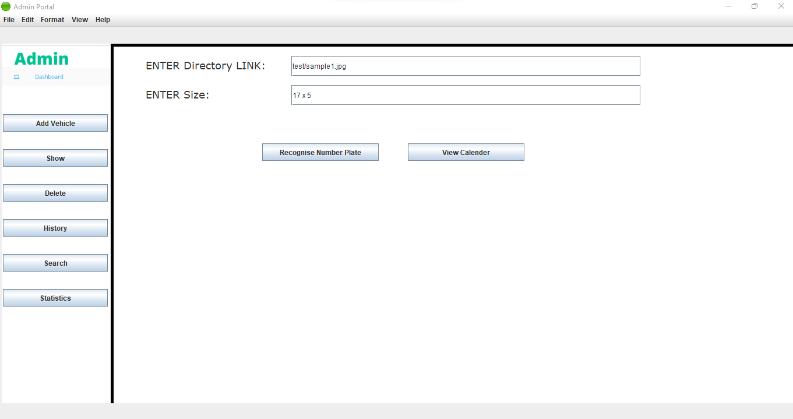
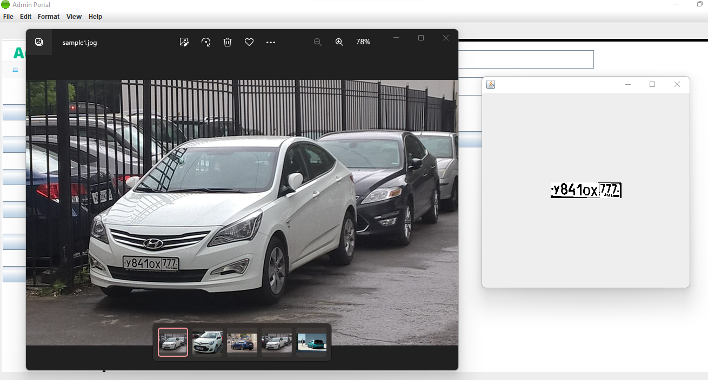

# Parking_Manangement_System_using_ANPR
This is a full-fledged Software Comprising of various aspects of a software that requires Details of a parked vehicle at current time.

Copyright: Any act of Copying for financial gain without prior approval and paper-work will attract legal proceedings.

Features:- 
          
          1. It detects Number Plate from Image, Automatically!!. User need NOT worry about manually going to car and checking the number plate.
          2. User can view historical trends in Database. Get details of parked vehicle at any point in time if any need arises.
          3. Real time traffic counting system.

Pre-requisites:-
          
          1. A Camera Image is necessary which will have image of Car with it's Number Plate.
          2. All Collected Images should be Placed in test folder.
          3. All Outputs will be placed in changes folder which will automatically update with each recognition.
          4. Admin has to enter details of car parked, which will be present in respective Databases.
          5. You need to add jar files dependencies and some DLL file paths in project libraries and properties respectively.

How to run:-

        1. Run Welcome.java file and go to Admin Portal. You would see something like this:-
        

       
        
        2. The Username is "admin" and Password is "12345".
        
        3. After Login you need to Enter the directory name as follows where your dataset is loaded:-
        

        4. Once we get the number plate from Image, we can play around with different Options like inserting the details of the car, searching it from the database and deleting once car goes out. Please note delte operartion will only delete data from current details table, but all the trends and details of cars parked anytime will always remain in History database.
        
                                                                                                                                            

